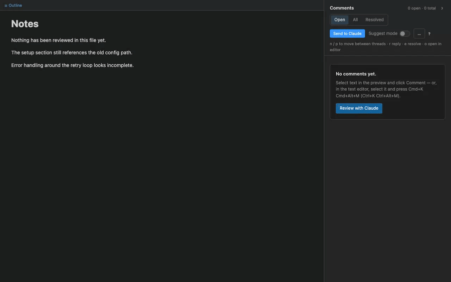
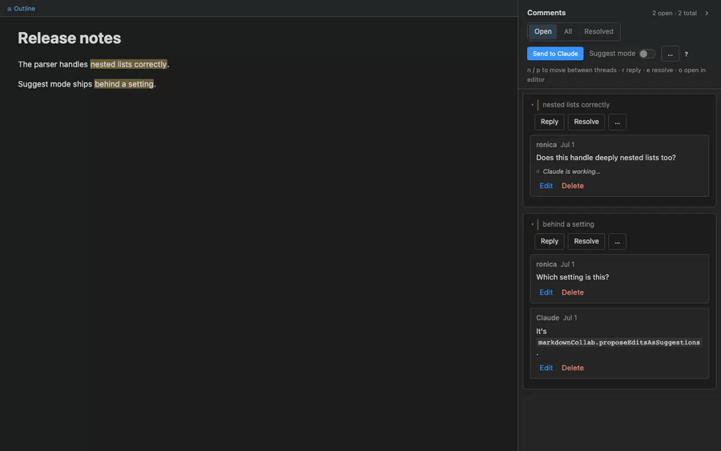

# Markdown Collab

[](https://marketplace.visualstudio.com/items?itemName=markdown-collab.markdown-collab-plugin)
[](https://open-vsx.org/extension/markdown-collab/markdown-collab-plugin)

Review Markdown *with* Claude, in VS Code. Comments live inside the `.md` file, anchored to the text they're about. Claude reads them, replies, and proposes edits you accept or reject. Or it reviews the document and leaves comments for you.



Click **Review with Claude**. Claude reads your doc and leaves a comment per concern, and you triage them. No terminal to open, nothing to paste. It needs Claude Code installed and signed in, and nothing else.

## What you get

- **Comments stored in the file.** Each thread is an HTML comment wrapped around the exact passage it points at, so it's invisible on GitHub and in every preview, and it survives a commit, a branch switch, and a colleague opening the file. No sidecar, no database.
- **Claude as reviewer or as writer.** Ask Claude to review a document, a folder, or only what changed since its last pass. Or leave comments yourself and send them; Claude edits the document and replies in each thread.
- **Suggestions you can undo.** In suggest mode, Claude's edits arrive as tracked changes. Accept applies one, Reject keeps your wording, and both are ordinary editor edits, so Cmd+Z takes them back.
- **A review view, and the text editor too.** A rendered preview with a threads sidebar, plus dimmed markers, hovers, and a CodeLens in the plain text editor, so a reviewed file never looks corrupted.
- **Other agents.** The review tools are an MCP server. Cursor, Codex, GitHub Copilot, and any other MCP client can use them; comments say which agent wrote them.

## Get started

1. **Install the extension.** Search **Markdown Collab** in the Extensions view, or:
   ```bash
   code --install-extension markdown-collab.markdown-collab-plugin
   ```
   Cursor, Windsurf, VSCodium, and Gitpod install it from [Open VSX](https://open-vsx.org/extension/markdown-collab/markdown-collab-plugin). A `.vsix` is on every [GitHub release](https://github.com/ronicayu/markdown-collab-plugin/releases).
2. **Connect an Agent…, once per machine.** `Cmd-Shift-P` → **Markdown Collab: Connect an Agent…** → **Claude Code**. This installs the Markdown Collab plugin into Claude Code — the review workflow as `/markdown-collab:review`, the anchor-safe `mdc` helper on Claude's PATH, a check that tells Claude the moment an edit breaks a comment anchor — and registers this extension's review tools in the same step, so Claude's edits arrive as edits you can undo. It installs from a marketplace the extension keeps on your machine, so the plugin always matches the extension's version, and it offers an update when a new one ships. Restart any running Claude session afterwards, or run `/reload-plugins`. Using Cursor, Codex, or Copilot instead? The same command lists them — see [Connect an agent](#connect-an-agent) below.
3. **Open a Markdown file** and click the comment icon in its title bar. Then either click **Review with Claude**, or select a passage in the preview, click **Comment**, write your note, and click **Send to Claude**.

Want to try it with no Claude at all? **Markdown Collab: Open Tutorial Playground** writes a scratch document that arrives mid-review, with threads, a reply, and two pending suggestions to accept or reject.

Without the extension, the Claude side is also available on its own: `claude plugin marketplace add ronicayu/markdown-collab-plugin`, then `claude plugin install markdown-collab@markdown-collab`.

## The loop

**Comment → send → Claude edits and replies → accept → resolve.**

1. **Comment.** Select a passage in the preview and write a note. The thread is written into the file, around the exact text it points at.
2. **Send.** One button. Claude gets your unresolved threads and the document.
3. **Claude works.** It edits the doc and replies in each thread with what it changed. In suggest mode it proposes changes instead. The thread card shows what Claude is doing while it does it.
4. **Accept or reject.** A suggestion is a tracked change. Accept applies it; Reject keeps your wording; **Accept all** takes the whole batch after a second click.
5. **Resolve** when you're satisfied, or reply and go round again.



**Suggest mode** is the toggle next to the Send button, or `markdownCollab.proposeEditsAsSuggestions`. Sending one thread from its card works the same way as sending them all.

## Asking Claude to review

Right-click a `.md` file → **Ask Agent to Review This Doc**, or click **Review with Claude** in an empty sidebar. Claude opens one thread per substantive concern: a wrong claim, an ambiguous sentence, a broken example, a contradiction with another section. There is no cap; if thirty things warrant a thread, you get thirty. Pure typos and style preferences are skipped unless you ask for them. If Claude finds nothing, it says so instead of inventing something.

The sidebar shows *"N new from Claude · M reviewed"* with a **Next** button, and a thread counts as reviewed once you reply to or resolve it. Files over 50 KB ask for a confirmation before sending.

- **Focus.** The command asks for an optional one-line directive, such as *"check the API examples"* or *"find marketing tone"*. Your last five are offered again.
- **Standing conventions.** **Edit Review Conventions** creates `.markdown-collab/conventions.md` from a template: the product's name, the house tone, the things you've decided not to care about. Every review carries it, so Claude stops re-raising what you've settled. It's capped at 4 KB per request, and the payload says so if it was cut.
- **Only what changed.** **Ask Agent to Review What Changed** sends the sections that moved since Claude's last review and lists the threads that already exist, so a resolved concern stays resolved. Claude records a checkpoint in the file when it finishes a pass through the review tools or the `mdc` helper; the first review of a file is a full one.
- **A whole folder.** Right-click a folder, or multi-select files, → **Ask Agent to Review These Docs**. Every `.md` goes into one pass, so Claude can compare the documents against each other: terminology that drifts, a claim one file contradicts, a cross-reference that no longer resolves. **Next Unread from Agent** walks the results across every file.

Afterwards, **Review Session Summary** turns the thread state into a digest for a PR description or a note to a colleague.

## Where it shows up

**The review view.** Rendered preview on the left, threads on the right. Comments render as Markdown. There's a find bar, a collapsible outline, optional source line numbers, and buttons to remove every resolved thread or every trace of review data in one undoable step. Mermaid and PlantUML fences and linked draw.io files render in the preview.

**The text editor.** Anchors are dimmed, commented text is tinted, and the threads block at the end of the file folds away. Hovering a commented passage shows its thread, with a link into the review view, and one CodeLens at the top of the file gives the counts and opens the view. Select text and press `Cmd+K Cmd+Alt+M` to comment without leaving the editor.

**Uncommitted changes.** An **Uncommitted Markdown** tree in the Explorer lists every Markdown file that differs from HEAD. Each opens in the review view with changed blocks striped, removed text shown struck through where it used to be, arrows to step between changes, and stage and unstage buttons on each row. The diff is prose against prose, so a paragraph that only gained an anchor isn't marked as changed.

**Pull requests and merge requests.** **Open PR Review** shows the Markdown a GitHub PR or GitLab MR changed, rendered, with the platform's existing comments inline. Add comments, reply, edit your drafts, and post them back. This is a review client for a colleague's Markdown, not an agent loop: the comments live on the PR or MR, not in the file. It uses your `gh` or `glab` sign-in; no extra tokens.

**The live editor.** A WYSIWYG editor with the same threads sidebar, for one person and an agent on the same machine: you type, the agent edits the file on disk, both show up live. Open a `.md` with **Open With… → Markdown Collab (live editor)**, or run **Open Live Editor**. The review view and the live editor share one sidebar and differ in whether the rendered text is editable; they are on their way to becoming one view, read-only by default with editing a toggle.

## How your comments reach Claude

The **Send to Claude** button delivers one of three ways. The first click asks, remembers your answer per workspace, and never asks again. **Reset Send Mode** clears it.

| Mode | What happens | Choose it when |
|---|---|---|
| `headless` | **Run Claude for me.** The extension runs Claude Code in the background and shows progress in the status bar. | Claude Code is installed and signed in, and you'd rather not keep a terminal open. |
| `terminal` | Types the prompt into your running Claude session. If a Claude terminal is already open, this is picked for you. | Works everywhere. |
| `clipboard` | Copies the prompt for you to paste. | You'd rather hand it off yourself. |

### Run Claude for me

Headless runs are offered first in the picker whenever they can work, but never chosen for you. What they need: Claude Code installed and signed in (run `claude` once in a terminal if you never have), a trusted workspace, and the review tool server, which starts with the extension. If `claude` isn't on the PATH VS Code sees, set `markdownCollab.claudePath`. `markdownCollab.headlessModel` picks the model.

In this mode Claude can read files and use this extension's review tools, and nothing else: no shell, no direct file edits, no other MCP servers, and none of your Claude Code hooks. Every change lands through the editor, undoable and checked before it applies. The status bar reads *Claude is reviewing guide.md · 1m 20s* while it works; click it to cancel, and a run stops itself after 30 minutes. When it finishes, a notification carries the first line of Claude's report, with **Show report** for the whole thing and the estimated cost.

If a run can't start, the send goes to your terminal and the toast says why. If Claude Code can't load the review tools (MCP disabled by policy), headless stops being offered in that workspace until you reset the send mode.

### What the status bar shows

Every review request has a pulse, whichever way it was sent. Each state is something the extension observed, not a guess.

| You see | It means |
|---|---|
| *Sent for review · 1m 20s* | The prompt went out; nothing has come back yet. |
| *Claude: reading 2 of 3 files* | Claude reported its phase through the review tools. |
| *Review in progress · 3 new comments* | Threads are landing. Claude opens them one at a time. |
| *Review arrived: 12 new comments* | Every file is finished. *No concerns found* is also an answer. |
| *Review sent 10m ago — nothing arrived* | Ten minutes of silence. Click for Resend, Dismiss, or Show logs. |

## Connect an agent

Whichever mode you use, an agent's edits are best made through this extension's review tools: they arrive as editor edits you can undo, and a change that would break an anchor is refused before it lands, not repaired after.

**Connect an Agent…** hooks the review tools up to whichever client you use. The list shows only the entries your editor can support.

| Client | What it writes |
|---|---|
| Claude Code | Installs the Claude Code plugin and adds a `markdown-collab` entry to the workspace's `.mcp.json`, in one step. If Claude is already running, `/mcp` reconnects it. |
| Cursor, in-app agent | Nothing on disk. Registered live for the session, and again after each reload. |
| Cursor CLI | `.cursor/mcp.json` with environment references. Restart `cursor-agent`. |
| Codex | A `[mcp_servers.markdown-collab]` table in `.codex/config.toml`, with the loopback address and the name of the token's environment variable. Codex loads it once you trust the project. |
| GitHub Copilot, agent mode | Nothing on disk. Enable the Markdown Collab tools in Copilot's tool picker. |
| Anything else | A scratch document with the address, the token, and a snippet to copy. |

No token is ever written to a file. Comments written by another agent are credited to it: the sidebar says *"3 new from Codex"*, and the card says who replied.

Connecting is always your call. If your agent doesn't have the tools, every prompt tells it to use the `mdc` helper instead, and the file ends up the same.

**Disconnect an Agent…** removes an entry you no longer want registered.

## Keyboard

| Keys (mac / win + linux) | Where | Does |
|---|---|---|
| `Cmd+K Cmd+Alt+V` / `Ctrl+K Ctrl+Alt+V` | a Markdown editor | Open the review view |
| `Cmd+K Cmd+Alt+M` / `Ctrl+K Ctrl+Alt+M` | a Markdown editor, with a selection | Comment on the selection |
| `Cmd+K Cmd+Alt+N` / `Ctrl+K Ctrl+Alt+N` | a Markdown editor or the review view | Next unread thread from Claude |
| `n` / `p` | the review view | Next or previous thread; next or previous change when a diff is showing |
| `r` | the review view | Reply to the highlighted thread |
| `e` | the review view | Resolve or reopen the highlighted thread |
| `o` | the review view | Open the highlighted thread's text in the editor |

The single keys do nothing while you're typing. There's no key for accepting a suggestion on purpose: that stays a click on the card you can see.

## Commands

| Command | Does |
|---|---|
| Open Review View | Also the title-bar icon and the right-click menu on `.md` files. |
| Comment on Selection | Start a thread from a selection in the text editor. |
| Send Unresolved Comments to Agent | The Send button, from the palette. |
| Ask Agent to Review This Doc / These Docs | An agent as reviewer, for one file or a folder. |
| Ask Agent to Review What Changed | Review only what moved since the last pass. |
| Next Unread from Agent | Jump to the next thread an agent opened that you haven't answered, across every file. |
| Toggle Suggest Mode | Ask Claude to propose edits instead of applying them. |
| Edit Review Conventions | Create or open `.markdown-collab/conventions.md`. |
| Review Session Summary | A digest of the thread state, ready to paste. |
| Open Uncommitted Changes | Refresh and focus the uncommitted-changes tree. |
| Open PR Review | Review the Markdown a GitHub PR or GitLab MR changed. |
| Open Live Editor (experimental) | The WYSIWYG editor with the threads sidebar. |
| Remove All Resolved Comments | Delete every resolved thread, anchors included. One undo step. |
| Remove All Review Data | Strip every comment, anchor, and checkpoint, leaving clean Markdown to commit. A pending suggestion is discarded, not applied. One undo step. |
| Repair Comment Anchors | Fix the anchor damage that can be fixed without guessing. |
| Connect an Agent… | Hook the review tools up to Claude Code, Cursor, Codex, Copilot, or another MCP client. |
| Disconnect an Agent… | Remove an agent's entry you no longer want registered. |
| Open Tutorial Playground | The scratch document that arrives mid-review. |
| Show Logs | The Markdown Collab output channel. Set it to Trace for per-send and per-tool-call detail. |
| Report a Problem | An environment report for an issue: versions, send mode, Claude Code, plugin, tool server, connected agents, per-document review state. Tokens are redacted. |

A few commands still exist but are hidden from the palette, now that Connect an Agent… covers the everyday path: Set Up Claude Code and Register Review Tools with Claude Code (both folded into it), Start Claude Review Terminal, Copy Claude Prompt (the clipboard send mode replaces it), Reset Send Mode (linked from the setting instead), and Initialize AGENTS.md.

## Settings

| Setting | Default | Does |
|---|---|---|
| `markdownCollab.sendMode` | `ask` | `ask`, `headless`, `terminal`, or `clipboard`. |
| `markdownCollab.proposeEditsAsSuggestions` | `false` | Suggest mode: Claude proposes edits instead of applying them. |
| `markdownCollab.claudePath` | `""` | Path to `claude` if it isn't on the PATH VS Code sees. |
| `markdownCollab.headlessModel` | `""` | Model for headless runs, such as `sonnet` or `opus`. Empty uses Claude Code's default. |
| `markdownCollab.showLineNumbers` | `false` | Source line numbers beside each block in the review view and the live editor. They're lines of the `.md` file, frontmatter and threads block included, so they match Go to Line. |
| `markdownCollab.collab.userName` | your OS username | The name on comments you write in the live editor. |
| `markdownCollab.plantuml.serverUrl` | `https://www.plantuml.com/plantuml` | The server that renders `plantuml` fences. Diagram source is sent to it, so point it at your own server for private documents. |
| `markdownCollab.plantuml.format` | `svg` | `svg` or `png`. |

## What's in your files

A thread is two anchors around the passage and one JSON line in a block at the end of the file. All of it is HTML comments.

```markdown
The <!--mc:a:k7q3p-->quick brown fox<!--mc:/a:k7q3p--> jumps…

<!--mc:threads:begin-->
<!--mc:t {"id":"k7q3p","quote":"quick brown fox","status":"open","comments":[{"id":"c1","author":"ronica","ts":"2026-05-13T12:00:00Z","body":"too cliched"}]}-->
<!--mc:threads:end-->
```

Commit the file as it is; the review state ships with it. When you're done reviewing, **Remove All Review Data** strips everything in one step.

Under `.markdown-collab/`, the extension writes runtime state for the tool server and, if you create it, your conventions file. Ignore the first, commit the second:

```gitignore
.markdown-collab/
!.markdown-collab/conventions.md
```

## Troubleshooting

**Start with Report a Problem.** It answers the first questions of any diagnosis in one paste, with tokens redacted. Then set **Show Logs** to Trace and reproduce: every send, tool call, refusal, and `gh`/`glab` call is logged with its outcome.

**Review with Claude isn't offered.** Headless needs `claude` on the PATH VS Code sees (or `markdownCollab.claudePath`), a trusted workspace, and the tool server. The diagnostics report says which is missing.

**Claude replied in the terminal, but nothing changed in the file.** Claude may not have the review tools or the plugin. Run **Connect an Agent…** → **Claude Code**, and restart the Claude session.

**A thread is unanchored.** Its passage was deleted or rewritten beyond recognition, so the anchors went with it. Select fresh text and leave the note again, or **Repair Comment Anchors** if the quote still matches exactly one place.

**Send did nothing.** `markdownCollab.sendMode` has a value this version doesn't recognize. Retired modes fall back to `terminal` with a one-time notice; anything else falls back to `ask`.

## Contributing

Building, the three test suites, and the release pipeline are described in [CONTRIBUTING.md](CONTRIBUTING.md).

## Out of scope

Real-time collaboration between people. "Collab" here means one person and an AI agent; the live editor is not multi-user.
