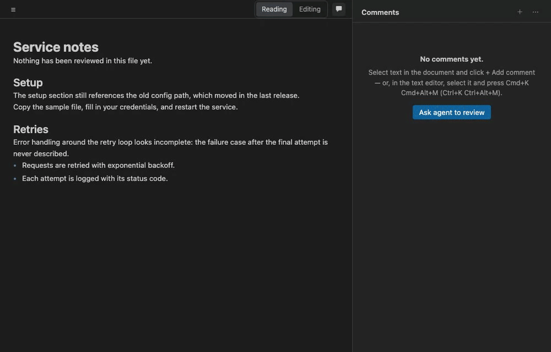

# Markdown Collab

[](https://marketplace.visualstudio.com/items?itemName=markdown-collab.markdown-collab-plugin)
[](https://open-vsx.org/extension/markdown-collab/markdown-collab-plugin)

Review Markdown *with* your AI agent — Claude Code, Cursor, Codex or Copilot — in VS Code, Cursor or Windsurf. Comments live inside the `.md` file, anchored to the text they're about. The agent reads them, replies, and proposes edits you accept or reject. Or it reviews the document and leaves comments for you.



Click **Ask agent to review**. The agent reads your doc and leaves a comment per concern, and you triage them. The first send asks how to reach your agent and remembers your answer — typing into a running terminal session is the normal path.

## What you get

- **Comments stored in the file.** Each thread is an HTML comment wrapped around the exact passage it points at, so it's invisible on GitHub and in every preview. The state stays in the file overnight and across sessions — strip it with **Remove All Review Data** before you commit; staging a file that still carries threads reminds you once. No sidecar, no database.
- **Your agent as reviewer or as writer.** Ask it to review a document, a folder, or only what changed since its last pass. Or leave comments yourself and send them; the agent edits the document and replies in each thread.
- **Suggestions you can undo.** In suggest mode, the agent's edits arrive as tracked changes. Accept applies one, Reject keeps your wording, and both are ordinary editor edits, so Cmd+Z takes them back.
- **The Markdown Collab view, and the text editor too.** The rendered document with a threads sidebar — read it, or switch to Editing and edit in place — plus dimmed markers, hovers, and a CodeLens in the plain text editor, so a reviewed file never looks corrupted.
- **Any agent.** Claude Code is the most complete setup — a plugin and the review tools in one step. Beyond it, the file format is the contract: copy the prompt and any agent can edit it by following `AGENTS.md`, no integration required. Connect Cursor, Codex, Copilot, or another MCP client as an optional second step, for edits you can undo; comments say which agent wrote them.

## Get started

1. **Install the extension.** Search **Markdown Collab** in the Extensions view, or:
   ```bash
   code --install-extension markdown-collab.markdown-collab-plugin
   ```
   Cursor, Windsurf, VSCodium, and Gitpod install it from [Open VSX](https://open-vsx.org/extension/markdown-collab/markdown-collab-plugin). A `.vsix` is on every [GitHub release](https://github.com/ronicayu/markdown-collab-plugin/releases).
2. **Connect an Agent…, once per machine.** `Cmd-Shift-P` → **Markdown Collab: Connect an Agent…** → **Claude Code**. This installs the Markdown Collab plugin into Claude Code — the review workflow as `/markdown-collab:review`, the anchor-safe `mdc` helper on Claude's PATH, a check that tells Claude the moment an edit breaks a comment anchor — and registers this extension's review tools in the same step, so Claude's edits arrive as edits you can undo. It installs from a marketplace the extension keeps on your machine, so the plugin always matches the extension's version, and it offers an update when a new one ships. Restart any running Claude session afterwards, or run `/reload-plugins`. Using Cursor, Codex, or Copilot instead? The same command lists them — see [Other agents](#other-agents) below.
3. **Open a Markdown file** and click the comment icon in its title bar. Then either click **Ask agent to review**, or select a passage in the rendered document, click **+ Add comment**, write your note, and click **Send**.

Want to try it with no agent at all? **Markdown Collab: Open Tutorial Playground** writes a scratch document that arrives mid-review, with threads, a reply, and two pending suggestions to accept or reject.

Without the extension, the Claude Code plugin is also available on its own: `claude plugin marketplace add ronicayu/markdown-collab-plugin`, then `claude plugin install markdown-collab@markdown-collab`.

## The loop

**Comment → send → the agent edits and replies → accept → resolve.**

1. **Comment.** Select a passage in the rendered document and write a note. The thread is written into the file, around the exact text it points at — and nothing else in the file changes.
2. **Send.** One button. Your agent gets your unresolved threads and the document.
3. **The agent works.** It edits the doc and replies in each thread with what it changed. In suggest mode it proposes changes instead. The thread card shows what the agent is doing while it does it.
4. **Accept or reject.** A suggestion is a tracked change. Accept applies it; Reject keeps your wording; **Accept all** takes the whole batch after a second click.
5. **Resolve** when you're satisfied, or reply and go round again.


**Suggest mode** is **Ask for suggestions instead of edits** in the menu beside the Send button — the button then reads *Send 2 comments as suggestions* — or `markdownCollab.proposeEditsAsSuggestions`. Each thread card has its own **Send** button, and it works the same way as sending them all. **Copy prompt** is the copy button beside the Send bar.

## Reviewing a colleague's PR

**Open PR Review** shows the Markdown a GitHub PR or GitLab MR changed, rendered, with the platform's existing comments inline — what changed and what's already been said, in one view. Add comments, reply, edit your drafts, and post them back through your `gh` or `glab` sign-in; no extra tokens.

This isn't an agent loop. There's no agent in it, and nothing gets written into the file: the comments live where they always did, on the PR or MR. It's a client for reading and answering them without leaving the editor.

## Asking your agent to review

Right-click a `.md` file → **Ask Agent to Review This Doc**, or click **Ask agent to review** in an empty sidebar. The agent opens one thread per substantive concern: a wrong claim, an ambiguous sentence, a broken example, a contradiction with another section. It ranks concerns by severity and opens threads for the five that matter most, plus one summary thread listing everything else so you can ask for any of them ("open 3 and 7") — add *"give me ten"* (or more) to the focus directive to raise the cap. Pure typos and style preferences are skipped unless you ask for them. If it finds nothing, it says so instead of inventing something.

The sidebar shows *"N new from Codex · M reviewed"* — named after whichever agent opened them — with a **Next** button, and a thread counts as reviewed once you reply to or resolve it. Files over 50 KB ask for a confirmation before sending.

- **Focus.** The command asks for an optional one-line directive, such as *"check the API examples"* or *"find marketing tone"*. Your last five are offered again.
- **Standing conventions.** **Edit Review Conventions** creates `.markdown-collab/conventions.md` from a template: the product's name, the house tone, the things you've decided not to care about. Every review carries it, so the agent stops re-raising what you've settled. It's capped at 4 KB per request, and the payload says so if it was cut.
- **Only what changed.** **Ask Agent to Review What Changed** sends the sections that moved since the last review and lists the threads that already exist, so a resolved concern stays resolved. The agent records a checkpoint in the file when it finishes a pass through the review tools or the `mdc` helper; the first review of a file is a full one.
- **A whole folder.** Right-click a folder, or multi-select files, → **Ask Agent to Review These Docs**. Every `.md` goes into one pass, so the agent can compare the documents against each other: terminology that drifts, a claim one file contradicts, a cross-reference that no longer resolves. **Next Unread from Agent** walks the results across every file.

Afterwards, **Review Session Summary** turns the thread state into a digest for a PR description or a note to a colleague.

## Where it shows up

**The Markdown Collab view.** The rendered document on the left, threads on the right. It opens read-only: select a passage and comment, and the comment's two markers are written into the file's original bytes, so nothing else in the file changes and every highlight sits exactly where its markers are. Switch to **Editing** in the toolbar above the document to edit in place; a change rewrites only the block you typed in. The agent's edits to the file show up as they land. Comments render as Markdown. There's a find bar, a collapsible outline, optional source line numbers, and buttons to remove every resolved thread or every trace of review data in one undoable step. Mermaid and PlantUML fences and linked draw.io files render in the document. It's also in **Open With… → Markdown Collab**. `markdownCollab.classicReviewView` brings back the previous Markdown Collab view, a rendered preview without editing, as a fallback; a later release removes it.

**The text editor.** Anchors are dimmed, commented text is tinted, and the threads block at the end of the file folds away. Hovering a commented passage shows its thread, with a link into the view, and one CodeLens at the top of the file gives the counts and opens the view. Select text and press `Cmd+K Cmd+Alt+M` to comment without leaving the editor.

**Uncommitted changes.** An **Uncommitted Markdown** tree in the Explorer lists every Markdown file that differs from HEAD. Each opens in the view with changed blocks striped, removed text shown struck through where it used to be, arrows to step between changes, and stage and unstage buttons on each row. The diff is prose against prose, so a paragraph that only gained an anchor isn't marked as changed. A file that still carries review threads shows the count in the tree, and staging it reminds you once that **Remove All Review Data** strips them.

## How your comments reach your agent

The **Send** button delivers one of three ways. The first click asks, remembers your answer per workspace, and never asks again. **Reset Send Mode** clears it.

**Type into the active terminal** is the recommended, normal path: if Claude is already running in a terminal, this is picked for you without asking; otherwise the picker lists it first. The prompt goes to the terminal you're using, so start your agent there first. If nothing is running in your terminals, you're offered to copy the prompt instead. It works with any agent's terminal, not only Claude's.

### Other ways to send

| Mode | What happens | Choose it when |
|---|---|---|
| `headless` | **Run Claude for me.** The extension runs Claude Code in the background and shows progress in the status bar. | You'd rather not keep a terminal open. Still needs Claude Code installed and signed in. |
| `clipboard` | Copies the prompt for you to paste. | You'd rather hand it off yourself. |

Headless runs are offered in the picker whenever they can work, but never chosen for you. What they need: Claude Code installed and signed in (run `claude` once in a terminal if you never have), a trusted workspace, and the review tool server, which starts with the extension. If `claude` isn't on the PATH VS Code sees, set `markdownCollab.claudePath`. `markdownCollab.headlessModel` picks the model.

In this mode Claude can read files and use this extension's review tools, and nothing else: no shell, no direct file edits, no other MCP servers, and none of your Claude Code hooks. Every change lands through the editor, undoable and checked before it applies. The status bar reads *Claude is reviewing guide.md · 1m 20s* while it works; click it to cancel, and a run stops itself after 30 minutes. When it finishes, a notification carries the first line of Claude's report, with **Show report** for the whole thing and the estimated cost.

If a run can't start, the send goes to your terminal and the toast says why. If Claude Code can't load the review tools (MCP disabled by policy), headless stops being offered in that workspace until you reset the send mode.

### What the status bar shows

Every review request has a pulse, whichever way it was sent. Each state is something the extension observed, not a guess.

| You see | It means |
|---|---|
| *Sent for review · 1m 20s* | The prompt went out; nothing has come back yet. |
| *Claude: reading 2 of 3 files* | The agent reported its phase through the review tools, and who it is. |
| *Review in progress · 3 new comments* | Threads are landing. The agent opens them one at a time. |
| *Review arrived: 12 new comments* | Every file is finished. *No concerns found* is also an answer. |
| *Review sent 10m ago — nothing arrived* | Ten minutes of silence. Click for Resend, Dismiss, or Show logs. |

## Other agents

The file format is the contract, and any agent that reads project instructions can act on it — Cursor, Codex, Copilot, or anything else:

1. **Copy the prompt.** Set the send mode to `clipboard`, or pick it from the picker on your first send — the prompt goes to your clipboard instead of a terminal.
2. **The agent edits the file, following `AGENTS.md`.** [`docs/format.md`](docs/format.md) is the full contract — every marker, the threads block, the suggestion shape. The `AGENTS.md` snippet (written or refreshed by **Connect an Agent…**, or the hidden **Initialize AGENTS.md** command) points any agent that reads it at the same rules, so it can reply and open threads without a tool of its own.
3. **Repair Comment Anchors is the safety net.** If the agent breaks a marker anyway, it fixes what can be fixed without guessing. `mdc check` does the same check — but only from inside a Claude Code session; `mdc` isn't on any other agent's PATH.

### Optional: undoable edits through MCP

For an agent that can call MCP tools, **Connect an Agent…** hooks the review tools up directly: its edits arrive as editor edits you can undo, and a change that would break an anchor is refused before it lands, not repaired after. The list shows only the entries your editor can support.

| Client | What it writes |
|---|---|
| Claude Code | Installs the Claude Code plugin and adds a `markdown-collab` entry to the workspace's `.mcp.json`, in one step. If Claude is already running, `/mcp` reconnects it. |
| Cursor, in-app agent | Nothing on disk. Registered live for the session, and again after each reload. |
| Cursor CLI | `.cursor/mcp.json` with environment references. Restart `cursor-agent`. |
| Codex | A `[mcp_servers.markdown-collab]` table in `.codex/config.toml`, with the loopback address and the name of the token's environment variable. Codex loads it once you trust the project. |
| GitHub Copilot, agent mode | Nothing on disk. Enable the Markdown Collab tools in Copilot's tool picker. |
| Anything else | A scratch document with the address, the token, and a snippet to copy. |

The token is never written to `.mcp.json`, `.cursor/mcp.json`, `.codex/config.toml`, or any file you'd commit — those carry only environment references, or (Codex) the name of the environment variable that holds it. It is written to one file, `.markdown-collab/.mcp-server.json`, at permissions only your OS user can read, git-ignored, and deleted when the window closes. Comments written by another agent are credited to it: the sidebar says *"3 new from Codex"*, and the card says who replied.

Connecting is always your call — the three steps above work with no MCP registration at all.

**Disconnect an Agent…** removes an entry you no longer want registered.

## Keyboard

| Keys (mac / win + linux) | Where | Does |
|---|---|---|
| `Cmd+K Cmd+Alt+V` / `Ctrl+K Ctrl+Alt+V` | a Markdown editor | Open the file in Markdown Collab |
| `Cmd+K Cmd+Alt+M` / `Ctrl+K Ctrl+Alt+M` | a Markdown editor, with a selection | Comment on the selection |
| `Cmd+K Cmd+Alt+N` / `Ctrl+K Ctrl+Alt+N` | a Markdown editor or the Markdown Collab view | Next unread thread from an agent |
| `n` / `p` | the view | Next or previous thread; next or previous change when a diff is showing |
| `r` | the view | Reply to the highlighted thread |
| `e` | the view | Resolve or reopen the highlighted thread |
| `o` | the view | Open the highlighted thread's text in the editor |

The single keys do nothing while you're typing. There's no key for accepting a suggestion on purpose: that stays a click on the card you can see.

## Commands

| Command | Does |
|---|---|
| Open in Markdown Collab | Also the title-bar icon and the right-click menu on `.md` files. |
| Comment on Selection | Start a thread from a selection in the text editor. |
| Send Unresolved Comments to Agent | The Send button, from the palette. |
| Ask Agent to Review This Doc / These Docs | An agent as reviewer, for one file or a folder. |
| Ask Agent to Review What Changed | Review only what moved since the last pass. |
| Next Unread from Agent | Jump to the next thread an agent opened that you haven't answered, across every file. |
| Toggle Suggest Mode | Ask the agent to propose edits instead of applying them. |
| Reset Send Mode | Forget the remembered send mode; the next Send asks again. |
| Edit Review Conventions | Create or open `.markdown-collab/conventions.md`. |
| Review Session Summary | A digest of the thread state, ready to paste. |
| Open Uncommitted Changes | Refresh and focus the uncommitted-changes tree. |
| Open PR Review | Review the Markdown a GitHub PR or GitLab MR changed. |
| Remove All Resolved Comments | Delete every resolved thread, anchors included. One undo step. |
| Remove All Review Data | Strip every comment, anchor, and checkpoint, leaving clean Markdown to commit. A pending suggestion is discarded, not applied. One undo step. |
| Repair Comment Anchors | Fix the anchor damage that can be fixed without guessing. |
| Connect an Agent… | Hook the review tools up to Claude Code, Cursor, Codex, Copilot, or another MCP client. |
| Disconnect an Agent… | Remove an agent's entry you no longer want registered. |
| Open Tutorial Playground | The scratch document that arrives mid-review. |
| Show Logs | The Markdown Collab output channel. Set it to Trace for per-send and per-tool-call detail. |
| Report a Problem | An environment report for an issue: versions, send mode, Claude Code, plugin, tool server, connected agents, per-document review state. Tokens are redacted. |

A few commands still exist but are hidden from the palette, now that Connect an Agent… covers the everyday path: Set Up Claude Code and Register Review Tools with Claude Code (both folded into it), Start Claude Review Terminal, Copy Prompt (the clipboard send mode replaces it), and Initialize AGENTS.md.

## Settings

| Setting | Default | Does |
|---|---|---|
| `markdownCollab.sendMode` | `ask` | `ask`, `headless`, `terminal`, or `clipboard`. |
| `markdownCollab.proposeEditsAsSuggestions` | `false` | Suggest mode: the agent proposes edits instead of applying them. |
| `markdownCollab.claudePath` | `""` | Path to `claude` if it isn't on the PATH VS Code sees. |
| `markdownCollab.headlessModel` | `""` | Model for headless runs, such as `sonnet` or `opus`. Empty uses Claude Code's default. |
| `markdownCollab.showLineNumbers` | `false` | Source line numbers beside each block in the Markdown Collab view. They're lines of the `.md` file, frontmatter and threads block included, so they match Go to Line. |
| `markdownCollab.collab.userName` | your OS username | The name on comments you write. |
| `markdownCollab.liveEditor.readOnly` | `true` | Open the Markdown Collab view read-only. Switch to **Editing** in the toolbar above the document to turn editing on for that view; turn this off to open every view editable. |
| `markdownCollab.classicReviewView` | `false` | Use the previous Markdown Collab view, a rendered preview without editing. A fallback; a later release removes it. |
| `markdownCollab.plantuml.serverUrl` | `https://www.plantuml.com/plantuml` | The server that renders `plantuml` fences. Diagram source is sent to it, so point it at your own server for private documents. |
| `markdownCollab.plantuml.format` | `svg` | `svg` or `png`. |

### Privacy

A `plantuml` fence is rendered by sending its diagram source to `markdownCollab.plantuml.serverUrl` — public plantuml.com by default, including when you're just viewing a colleague's PR. An `http://` server sees that source in plaintext on the wire. Point the setting at your own server for anything private.

## What's in your files

A thread is two anchors around the passage and one JSON line in a block at the end of the file. All of it is HTML comments.

```markdown
The <!--mc:a:k7q3p-->quick brown fox<!--mc:/a:k7q3p--> jumps…

<!--mc:threads:begin-->
<!--mc:t {"id":"k7q3p","quote":"quick brown fox","status":"open","comments":[{"id":"c1","author":"ronica","ts":"2026-05-13T12:00:00Z","body":"too cliched"}]}-->
<!--mc:threads:end-->
```

The state stays in the file overnight and across sessions — a commit, a branch switch, a colleague opening the file, all fine. Strip it before you commit with **Remove All Review Data**, which clears everything in one step; staging a file that still carries threads reminds you once, in case you meant to run it first.

Under `.markdown-collab/`, the extension writes runtime state for the tool server and, if you create it, your conventions file. Ignore the first, commit the second:

```gitignore
.markdown-collab/
!.markdown-collab/conventions.md
```

## Troubleshooting

**Start with Report a Problem.** It answers the first questions of any diagnosis in one paste, with tokens redacted. Then set **Show Logs** to Trace and reproduce: every send, tool call, refusal, and `gh`/`glab` call is logged with its outcome.

**Run Claude for me isn't offered in the send-mode picker.** Headless needs `claude` on the PATH VS Code sees (or `markdownCollab.claudePath`), a trusted workspace, and the tool server. The diagnostics report says which is missing.

**Claude replied in the terminal, but nothing changed in the file.** Claude may not have the review tools or the plugin. Run **Connect an Agent…** → **Claude Code**, and restart the Claude session.

**A thread is unanchored.** Its passage was deleted or rewritten beyond recognition, so the anchors went with it. Select fresh text and leave the note again, or **Repair Comment Anchors** if the quote still matches exactly one place.

**Send did nothing.** `markdownCollab.sendMode` has a value this version doesn't recognize. Retired modes fall back to `terminal` with a one-time notice; anything else falls back to `ask`.

## Contributing

Building, the three test suites, and the release pipeline are described in [CONTRIBUTING.md](CONTRIBUTING.md).

## Out of scope

Real-time collaboration between people. "Collab" here means one person and an AI agent; the Markdown Collab view is not multi-user.
