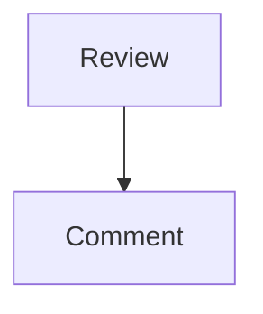
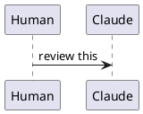
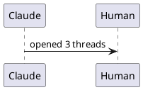

# Embed corpus

Every asset type the review surfaces have to render, in one document. Used by
`sharedEmbeds.test.ts` to pin that the markdown-it pipeline and the shared
asset resolvers agree about all of them.

## Images

A sibling image: 

A subdirectory image: 

A parent-relative image: 

A workspace-absolute image: 

An explicitly-relative image: 

A remote image: 

A protocol-relative image: 

An inline data image: 

## Mermaid



## PlantUML





## Draw.io

A diagram link: 

## Not embeds

A fenced block that only looks like one:

```text

```

An inline `` reference.

| Surface | Renderer |
|---|---|
| Inline comments | markdown-it |
| PR review | markdown-it |
| Live editor | Milkdown |
